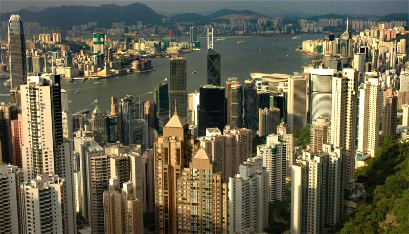
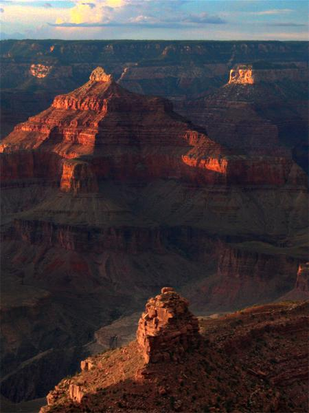

# Haze Removal

## Introduction

This is an simple implemention of "single image haze removal using dark channel prior" by kaiming He, which wins the CVPR09 best paper.

## Parameters by default
- radius=7
- omega=0.95
- t0=0.1
- r=60
- eps=0.001

## Dependencies

- numpy
- opencv-python
- skimage
- Pillow
- matplotlib
- numba

## Run

```bash
cd python_code
python haze_removal.py [your image path]
```


## DEMO

<figure class="half">
    
    
</figure>

<figure class="half">
    
    
</figure>


## References

- paper: Single Image Haze Removal using Dark Channel Prior
- paper: Guided Image Fltering
